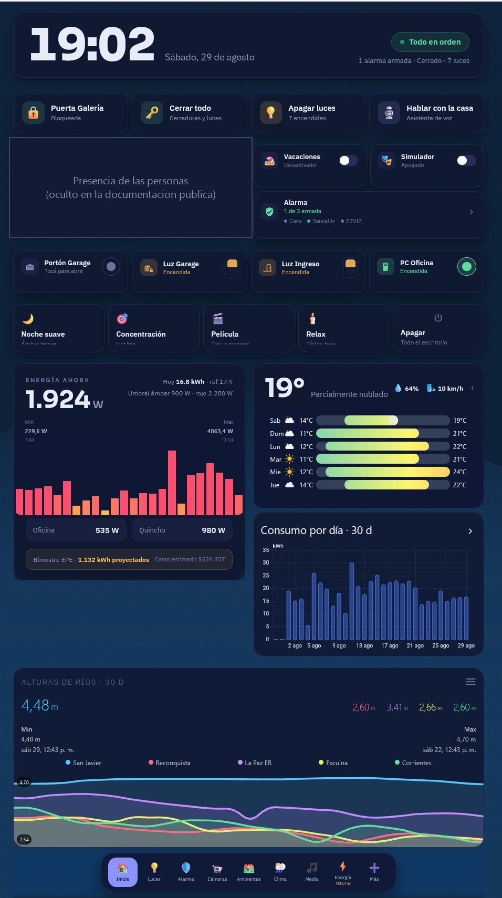
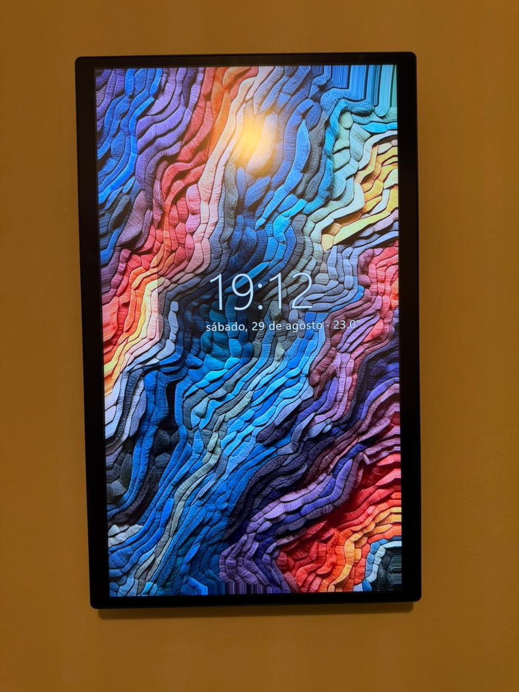
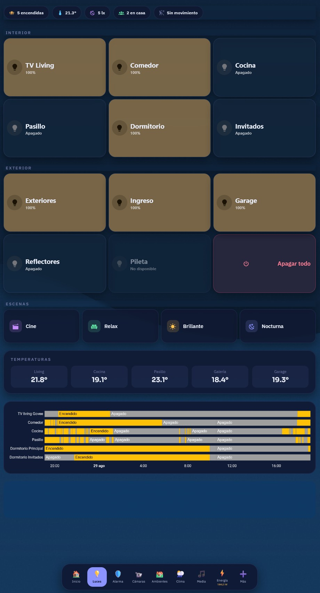
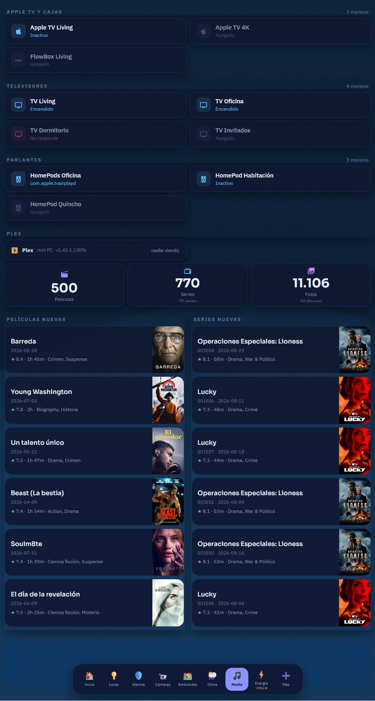
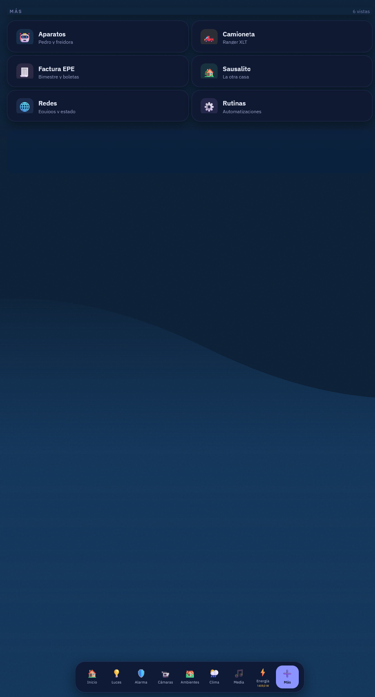

# Panel Vertical 2 — un tablero de Home Assistant generado por código

Un tablero para un **monitor vertical de pared**, escrito como programa en vez de a mano.
Son ~4.500 líneas de JavaScript que producen un dashboard de 31 vistas y lo suben a Home
Assistant por su API.



En la foto de arriba el bloque de presencia está tapado a propósito: eran los nombres, la
calle y las caras de quienes viven ahí. Todo lo demás es el panel real.

---

## La documentación

| | |
|---|---|
| [**INSTALACION.md**](docs/INSTALACION.md) | De cero a andando. Cuarenta minutos |
| [**ENTIDADES.md**](docs/ENTIDADES.md) | Las 184 entidades que usa, y dónde. **Se genera del código** |
| [**MODULOS.md**](docs/MODULOS.md) | Qué hace cada archivo |
| [**DECISIONES.md**](docs/DECISIONES.md) | Por qué está así, y qué se probó antes |

**Si vas a copiarlo**, andá a INSTALACION y después a ENTIDADES.
**Si querés entender cómo piensa**, andá a DECISIONES.

---

## Por qué está escrito como código y no armado en la interfaz

Un tablero de 31 vistas hecho a mano en el editor de Lovelace es imposible de mantener:
cambiar el radio de las tarjetas significa tocar 400 lugares, y no hay forma de saber si
quedó alguno afuera. Acá el radio es una constante:

```js
export const R = { grande: 24, media: 20, chica: 14, pill: 99 }
```

Se cambia en un lugar, se corre `node panel2/construir.mjs`, y las 31 vistas salen
consistentes. Lo mismo con los colores, las tipografías y los espaciados.

**El precio:** editar el tablero desde la interfaz de Home Assistant no sirve, porque la
próxima corrida lo pisa. El código es la fuente.

---

## Lo primero que hay que cambiar

Este código salió de una casa concreta y **está lleno de nombres de entidad que no vas a
tener**. Antes de correr nada:

| Qué | Dónde | Ejemplo de lo que vas a encontrar |
|---|---|---|
| La dirección de tu Home Assistant | `panel2/construir.mjs` y los scripts de subida | `TU_HOST_HA` |
| Los nombres de entidad | todos los archivos de `panel2/vistas/` | `light.luz_galeria`, `sensor.shelly_3em_...` |
| Las personas | `panel2/vistas/inicio.mjs` | `Persona 1`, `Persona 2` |
| Los ambientes | `panel2/vistas/habitaciones.mjs` | los de tu casa |

Los marcadores `TU_HOST_HA`, `TU_IP_LAN` y `Persona 1` están puestos a propósito: **si no
los cambiás, no anda**, y eso es mejor que un tablero que arranca mostrando datos vacíos.

La lista completa —**184 entidades**, con dónde se usa cada una— está en
[`docs/ENTIDADES.md`](docs/ENTIDADES.md), y se genera leyendo el código, no a mano.

**No hace falta cambiarlas todas de entrada.** Una entidad que no existe muestra `--` o
queda apagada: el panel a medio adaptar sigue siendo usable. Empezá por Inicio.

---

## Cómo está armado

```
packages/            la configuracion de Home Assistant que alimenta al panel
panel2/
  construir.mjs      lee el tablero actual, arma el nuevo, escribe el JSON
  diseno.mjs         LOS TOKENS: colores, radios, tipografías, y las piezas base
  navbar.mjs         la barra inferior de navegación
  restilar.mjs       envuelve tarjetas nativas de HA con el estilo del panel
  sonando.mjs        la tarjeta de "qué está sonando"
  plex.mjs           el bloque del servidor Plex
  bajar-iconos.mjs   descarga los íconos a color
  verificar.mjs      comprueba el resultado
  vistas/
    inicio.mjs       la pantalla principal
    luces.mjs        habitaciones.mjs  camaras.mjs  alarma.mjs  clima.mjs
    energia.mjs      media (en varias.mjs)  redes.mjs  automatizaciones.mjs
    mas.mjs          el cajón de las vistas secundarias
    simples.mjs      las que sólo se restilan
www/
  cuadro.js          el protector de pantalla (tarjeta propia)
```

### El flujo

```
node panel2/construir.mjs        genera panel-vertical-2.json
node ../scripts/ha/ha.mjs subir  lo sube por WebSocket
```

`construir.mjs` **lee el tablero que ya está en Home Assistant** y lo transforma. Eso
importa: las vistas que no se rediseñaron se conservan tal cual, y las que sí, se
reconstruyen. Se puede migrar de a poco.

---

## Los paquetes de Home Assistant

El tablero dibuja, pero los datos salen de algún lado. En `packages/` están los sensores,
plantillas y automatizaciones que lo alimentan. Van en `/config/packages/` con esto en el
`configuration.yaml`:

```yaml
homeassistant:
  packages: !include_dir_named packages
```

| Paquete | Qué aporta |
|---|---|
| `red_fisica.yaml` | Temperatura, CPU y tensión de los routers por SNMP; velocidad de cada boca del switch; **quién gobierna el árbol de expansión** |
| `redes_seguridad.yaml` | Sondas de internet, tráfico de la WAN, latencia, consultas a Cloudflare |
| `respaldos.yaml` | Vigilancia de las copias de seguridad |
| `panel_pasillo.yaml` | Encendido y apagado del monitor de pared |
| `media.yaml` | Reconecta las integraciones que se cuelgan calladas |
| `sentinel.yaml`, `auditoria.yaml` | Chequeos de salud del sistema |
| el resto | Sensores de aparatos concretos |

**Ninguno tiene una credencial adentro.** Las 23 que usan van por `!secret`, que es una
referencia a `secrets.yaml` — ese archivo no está acá y nunca debe estarlo.

### Una idea que quizá te sirva: mirar un número, no esperar un evento

`red_fisica.yaml` tiene un sensor que parece trivial y es el más útil del conjunto:

```yaml
- platform: snmp
  name: "Router costo al raiz"
  baseoid: 1.3.6.1.2.1.17.2.6.0     # dot1dStpRootCost: si vale 0, este equipo ES el raiz
```

El árbol de expansión de una casa se puede reorganizar solo y dejar de estar anclado en el
router sin que nada falle a la vista: la red sigue andando. El síntoma aparece semanas
después, cuando el equipo que quedó de raíz se reinicia y se lleva la red por delante unos
segundos. **No hay evento que avise.** Un número en la pantalla lo delata el primer día.

## Los tokens de diseño

Todo sale de `panel2/diseno.mjs`. Si querés otro aspecto, se cambia ahí y nada más.

```js
export const T = {
  pagina:  '#080d1a',              // el fondo
  tarjeta: 'rgba(15,23,48,.85)',   // translúcido: abajo hay un fondo animado
  borde:   'rgba(139,147,255,.14)',
  texto:   '#e8ecf7',
  texto2:  '#8b93b8',
  texto3:  '#6b74a0',
  acento:  '#8b93ff',
  ok: '#34c77b', alerta: '#ffc14f', peligro: '#ff4d6d', info: '#57c7ff',
  sora: 'Sora,system-ui,sans-serif',
  plex: 'IBM Plex Sans,system-ui,sans-serif',
}
```

**Las tarjetas son translúcidas a propósito**: el fondo del panel es un SVG animado, y un
`#0f1730` plano lo taparía.

### La pieza base

Casi todo el panel es un `custom:button-card` que sólo dibuja el HTML que se le pasa:

```js
tarjeta({
  html: js(`
    const s = states['light.living'];
    return '<span>' + (s.state === 'on' ? 'Prendida' : 'Apagada') + '</span>';
  `),
  entidad: 'light.living',        // dispara el redibujo cuando cambia
  tap: { action: 'toggle' },
})
```

`js()` envuelve el código en `[[[ ... ]]]`, que es como `button-card` marca sus plantillas.

> **Dos trampas que cuestan tiempo.** Ningún comentario dentro de `js()` puede llevar
> acento grave: cierra el template a la mitad y el error apunta a una línea que no tiene
> nada que ver. Y para interpolar una constante del build va `${LA_CONSTANTE}` a secas.

---

## El protector de pantalla

`www/cuadro.js` es una tarjeta propia que, tras unos minutos sin tocar la pantalla, la
cubre con una obra de arte a pantalla completa y la hora. Vuelve al tablero al primer
toque.



Se instala como recurso de Lovelace:

```yaml
# Ajustes → Tableros → Recursos
url: /local/cuadro.js
type: module
```

Y se usa poniendo la tarjeta en cualquier vista:

```yaml
type: custom:cuadro-card
inactividad: 240          # segundos sin tocar antes de aparecer
duracion_obra: 45         # segundos por obra
carpeta: /local/cuadros   # donde están las imágenes
solo_vertical: true       # no aparece en el celular
entidad_temp: sensor.temperatura_interior
```

Las imágenes van en `/config/www/cuadros/` con un `lista.json` al lado que las enumera —un
navegador no puede listar un directorio, así que el índice es explícito:

```json
["Cuadro 1.jpg", "Cuadro 2.jpg", "Cuadro 3.jpg"]
```

**El orden del índice manda y conviene curarlo**: las transiciones son mejores entre
imágenes parecidas, así que vale la pena agrupar por paleta en vez de ordenar por nombre.

### Lo que aprendimos haciéndolo

El protector dejaba de aparecer al minimizar y restaurar el navegador. El temporizador se
reiniciaba con los eventos de teclado y mouse, pero **no con `resize` ni con
`visibilitychange`**: al volver de minimizado, el contador quedaba colgado. Dos líneas:

```js
window.addEventListener('resize', this._revisar, { passive: true })
document.addEventListener('visibilitychange', this._revisar, { passive: true })
```

---

## Los íconos a color

La barra y varias tarjetas usan los PNG 3D de
[Fluent Emoji](https://github.com/microsoft/fluentui-emoji) (MIT). Se bajan una vez:

```
node panel2/bajar-iconos.mjs --bajar
```

**Quedan servidos por Home Assistant, no enlazados desde GitHub.** Un panel de pared no
puede depender de que internet ande para dibujar su propia barra.

La tarjeta de la barra no acepta imágenes por configuración, así que se pintan por CSS
sobre el `ha-icon`, apuntando por `data-index`:

```css
.lln-btn[data-index="0"] ha-icon {
  background: url('/local/iconos/color/casa.png') center / 26px 26px no-repeat;
  color: transparent !important;
}
```

**El ícono MDI se deja declarado igual**: si un PNG faltara, el CSS no pinta nada y queda
el glifo monocromo. Un ícono feo es mejor que un hueco.

> La carpeta se llama `iconos` y no `icons` porque el recurso Samba de Home Assistant no
> deja crear una carpeta con ese nombre en `/config/www`. Está comprobado, no es capricho.

---

## Decisiones que quizá te sirvan

**Los apagados se muestran.** Se pensó esconder los equipos que no responden. Saber que una
caja no responde *es* información; esconderla hace pensar que no existe. Se dibujan al 55 %
de opacidad.

**Un color tiene que significar algo.** La barra tuvo catorce colores, uno por vista, y era
ruido. Bajó a nueve elegidos para no repetirse entre vecinos. Los dos dinámicos —ámbar
cuando hay luces prendidas, rojo cuando la alarma se disparó— se ven justamente porque el
resto está quieto.

**La alarma armada es verde, no roja.** Armada es el estado que uno quiere. Pintarlo de rojo
deja la barra en alerta permanente, y cuando todo grita, nada grita.

**Que algo figure en una lista no prueba que funcione.** Una tarjeta puede estar en la vista,
con la entidad correcta, y no dibujarse. Un sensor puede pasar `check_config` y no crearse
nunca. Lo comprueba la pantalla o la entidad, no el validador.

---

## Más vistas

| | |
|---|---|
|  |  |
| **Luces** — sliders por ambiente, escenas e historial | **Media** — reproductores, el servidor Plex y los estrenos con carátula |



**Más** — el cajón de las vistas secundarias, para que la barra no tenga catorce ítems.

## Requisitos

- Home Assistant con el tablero en modo *storage*
- Node 22 o superior (usa `WebSocket` nativo)
- De HACS: `button-card`, `card-mod`, `auto-entities`, `mini-media-player`,
  `liquid-lens-navbar-card`, `mini-graph-card`

---

## Licencia

MIT. Los íconos son de Fluent Emoji, también MIT.
